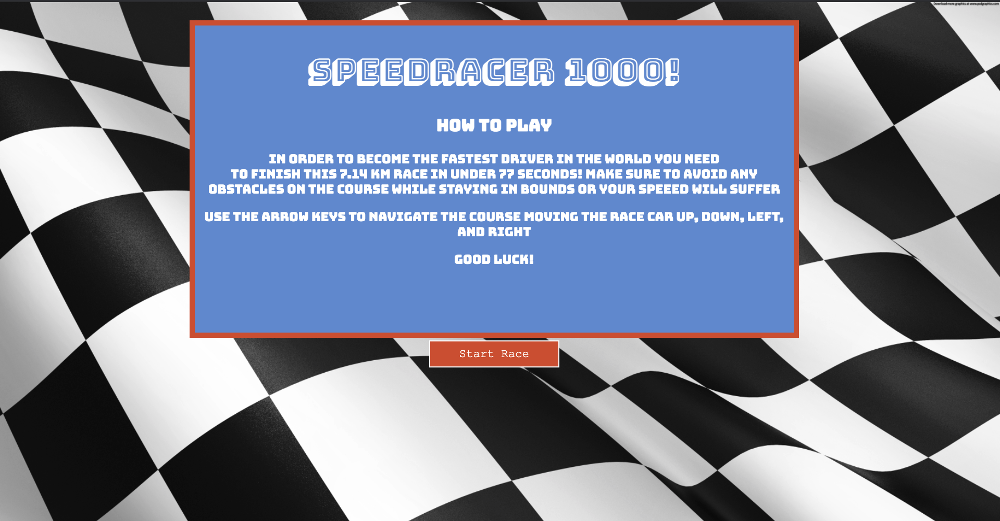

# SpeedRacer-1000

## Overview:
After spending some time learning about canvas I wanted to create a game using what I had just learned. The game will be focused on having a fun experience and quick gameplay. I picked this game because I want to build a game with Canvas that will challange me but is attainable to create. 

Game Rules:
1. Navigate vechile using left and right arrow key
1. Avoid obstacles 
1. Finish in time or be eliminated 

### Start Screen

### Select Car

### Game Play

## User Stories:
Control the race car using the left and right arrow. The left arrow will move the race car left and the right arrow will move it to the right. Use the arrow buttons to avoid any obstacles on the race track. If you fail to avoid any obstacles on the track the car will be slowed down significantly as you pass through the obstacles. If you do not finish the race in time you will be eliminated. 

## MVP:
1. Create racetrack with a pixel limit for length. 
1. Create a race car that can move left and righ using arrow functions
1. Create obstacles on the course and add collision detection. 
1. Slow down the vehicles if it collides with obstacles.
1. Create a finish line that tracks finishing time once it is crossed. 
1. Create a leaderboard to track fastest times. 

## Stretch Goals:
* Add coins to the map. These can be collected while the race is ongoing to increase the high score. 
* Add speed boosters to the game. These would increase the vehicle speed for several seconds to improve finishing time.
* Create another map that is more difficult to navigate through. 
* Add a 2 player mode. This will allow to compete with one another on the same track by taking turns. Highest score advances.

